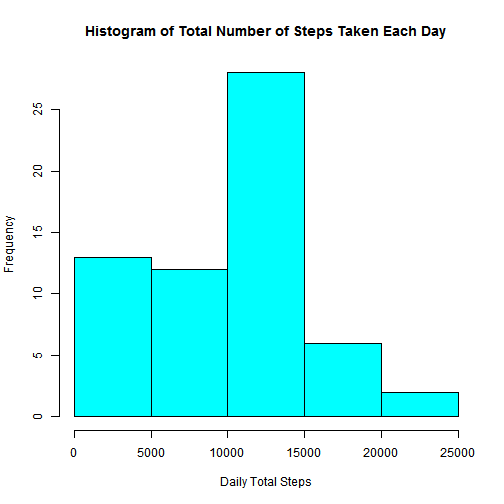
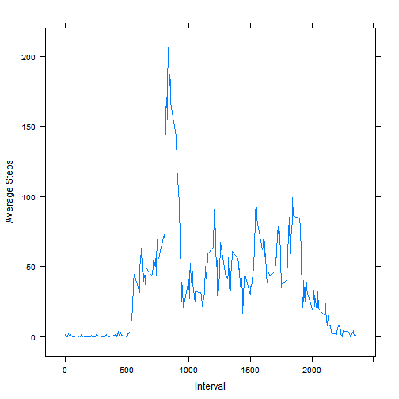
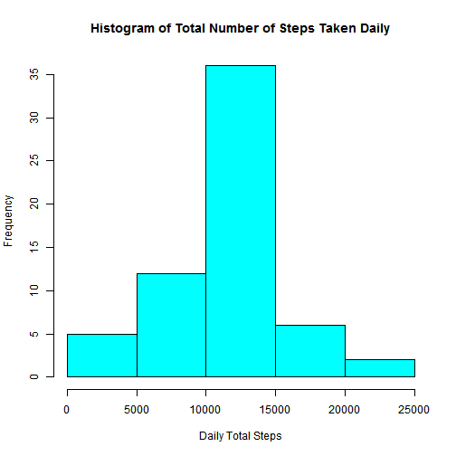
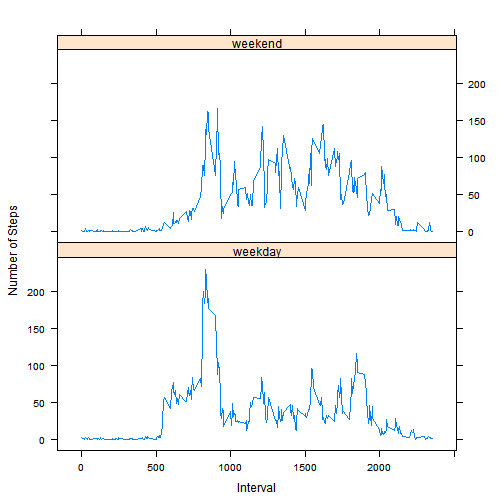

Report for Reproducible Research: Peer Assessment 1
====================================================

## Loading data

Unzip the data file and load the data

```r
aData <- read.csv(unz("activity.zip", "activity.csv"),
                  header=TRUE, comment.char="")
```


## What is the mean and median total number of steps taken per day?

Histogram of the total number of steps taken each day

```r
# First, calculate total number of steps taken each day
library(plyr)
dailySteps <- ddply(aData, .(date), 
                    function (x) sum(x$steps, na.rm = TRUE))
names(dailySteps) <- c("date", "steps")


# Next, plot the histogram
hist(dailySteps$steps, col="cyan", 
     xlab = "Daily Total Steps", 
     main = "Histogram of Total Number of Steps Taken Each Day")
```

 

```r
# Compute the mean and the median
meansteps <- round(mean(dailySteps$steps), 2)
mediansteps <- median(dailySteps$steps)

# dailySteps no longer needed so cleanup
rm(dailySteps)
```

**Mean total number of steps taken per day is 9354.23 and the median is 10395.**


## What is the average daily activity pattern?

```r
# First, calculate average number of steps per interval
avgSteps <- ddply(aData, .(interval), 
             function(x) mean(x$steps, na.rm=TRUE))
names(avgSteps) <- c("interval", "steps")

# Next, generate the time series plot
library(lattice)
xyplot(steps ~ interval, data=avgSteps, type="l", 
       xlab = "Interval", ylab = "Average Steps")
```

 

```r
# Which 5-minute interval, on average across all the days in the dataset, contains the maximum number of steps?
maxinterval <- avgSteps[which.max(avgSteps$steps),]$interval
```

**Interval # 835 contains the maximum number of steps on average across all the days.**

## Imputing missing values

```r
# Calculate the total number of missing values in the dataset
missing <- sum(!complete.cases(aData))

# Fill the missing values with the mean for that
# 5 min interval
fullData <- aData
for (i in seq_len(nrow(fullData))) {
        if (is.na(fullData[i,]$steps)) {
                fullData[i,]$steps <- 
                  avgSteps[avgSteps$interval 
                           == fullData[i,]$interval,]$steps
        }       
}

# Calculate total number of steps taken each day
dSteps <- ddply(fullData, .(date), 
                function (x) sum(x$steps))
names(dSteps) <- c("date", "steps")


# Next, plot the histogram
hist(dSteps$steps, col="cyan", 
     xlab = "Daily Total Steps", 
     main = "Histogram of Total Number of Steps Taken Daily")
```

 

```r
# Compute the mean and the median
# Show all 7 digits
options(scipen = 1, digits = 7)
meansteps <- round(mean(dSteps$steps), 2)
mediansteps <- round(median(dSteps$steps), 2)
```

**Total number of missing values in the dataset is 2304.**
**After imputing missing values, mean total number of steps taken per day is 10766.19 and the median is 10766.19.** These values differ from the mean and median values when the missing values were not filled in. After imputing the missing values with the mean of that interval, the mean and median are the same.


## Are there differences in activity patterns between weekdays and weekends?


```r
# Add a new factor variable in the dataset with two 
# levels - "weekday" and "weekend" indicating whether
# a given date is a weekday or weekend day.
fullData$day <- ifelse(weekdays(as.Date(as.character
                        (fullData$date))) == "Saturday" | 
                        weekdays(as.Date(as.character
                        (fullData$date))) == "Sunday",
                       "weekend", "weekday")

fullData$day <- as.factor(fullData$day)

# Calculate average # of steps taken per interval averaged
# across weekdays and weekends
tData <- ddply(fullData, .(interval,day), 
               function(x) mean(x$steps))
names(tData) <- c("interval", "day", "steps")

# Make a time series plot of the 5-minute interval (x-axis) 
# and the average number of steps taken, averaged across 
# all weekday days or weekend days (y-axis).

xyplot(steps ~ interval | day, data=tData, type="l", 
       layout=c(1,2), xlab = "Interval", 
       ylab = "Number of Steps")
```

 
